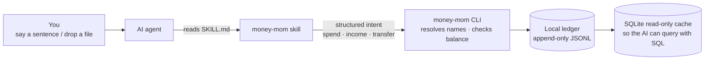
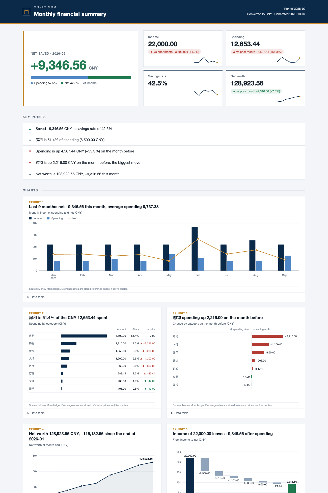

<p align="center">
  <picture>
    <source media="(prefers-color-scheme: dark)" srcset="assets/banner-dark.png">
    
  </picture>
</p>

<p align="center">
  <a href="README.md">简体中文</a> &nbsp;·&nbsp; <b>English</b> &nbsp;·&nbsp; <a href="https://imoneys10k.github.io/money-mom/?lang=en">Website</a>
</p>

<p align="center">
  <a href="https://github.com/imoneys10k/money-mom/actions/workflows/test.yml"></a>
  
  
  
</p>

# Money Mom

**Let your AI look after your money like Mom would.**

Money Mom is a **bookkeeping skill** for AI agents (Claude Code, Codex, Cursor, Gemini CLI, ...). You don't open a budgeting app: you say one sentence, or drop in a bank statement, and your AI records, queries and reconciles. The books are plain text files on your own computer. Nothing is uploaded and no company holds your data.

It is not another budgeting app. It makes AI bookkeeping **trustworthy**: the AI only understands what you said, and **a program keeps and checks the books**.

> **Status: pre-alpha (`0.1.0a4`).** The ledger core, the command line, statement import and reconciliation, many currencies, the monthly report, charts and subscription alerts work and are tested. It is not on PyPI or npm yet, and investor features are still ahead (see the [roadmap](ROADMAP.md)). Don't make it the only copy of your books.

## One-sentence install

Tell your AI agent:

```text
Please read https://github.com/imoneys10k/money-mom/blob/main/INSTALL.md and follow it to install Money Mom for me.
```

The agent reads [INSTALL.md](INSTALL.md): it installs the `money-mom` command (pinned version, SHA-256 verified), puts the skill into your agent, asks whether you want Chinese or English account names and which base currency, and finishes with a self-check that writes nothing. It tells you what it is about to do at each step.

## What it feels like

```text
You   Lunch at Luckin, 38, paid with Alipay
Mom   Recorded: coffee 38, from Alipay.

You   Sent Xiao Wang 200
Mom   Is that a loan, a treat, or a gift?              <- asks when unsure, never guesses

You   Salary 18,500 arrived in my bank card
Mom   Recorded. Your savings rate is 39% so far, up from last month.

You   Why did I spend so much on takeout this month?
Mom   612 more than last month, mostly one 486 dinner on the 20th. Every number links to its entry.
```

> This is the target experience. Recording, follow-up questions and querying are implemented through the skill and command line; the monthly report is `money-mom report`; the "Mom" tone levels for her remarks are planned.

## Why you can trust it

| Principle | How |
|---|---|
| **Double-entry** | Every amount records where it came from and where it went; each currency must balance exactly or the whole entry is refused. |
| **The AI never writes the books** | The AI says "spent 38, from Alipay, on coffee"; direction, checks and writing are done by a program. |
| **Append-only** | A mistake is voided and re-recorded, never erased. Every entry keeps its source, confidence and author. |
| **Never guesses** | Account names resolve only by full name, alias or a unique match; anything vague becomes *pending* with candidates listed. An AI confidence below 0.9 also waits. |
| **Locked after reconciling** | A period you checked against the bank is locked; only you can change it, with a written reason. |
| **Local-first** | Your data stays on your machine as human-readable text; the program does not use the network by default and has no runtime dependencies. The one exception is `rates update`, which you run yourself to fetch exchange rates; it sends only currency codes and a date, never an amount or an account. |

## How it works



The ledger is a stream of append-only events (open, transaction, confirm, void, balance assertion); balances are derived from it. See the [data model](docs/data-model.md) and the [design notes](docs/design.md) (in Chinese).

## Try the command line

Needs Python 3.11+. Install from source:

```bash
git clone https://github.com/imoneys10k/money-mom && cd money-mom
python -m pip install -e .

export MONEY_MOM_HOME=~/MoneyMom        # keep the ledger outside the repo
money-mom init --template en --base-currency USD --date 2026-01-01

money-mom transfer 5000 --from opening --to checking --date 2026-01-02   # opening balance
money-mom income 3200 --to checking --category salary --date 2026-10-01
money-mom spend 4.50 --from cash --category coffee --payee "Blue Bottle"  # direction is decided by the program
money-mom spend 45 --from card --category cof                              # unsure name: not guessed, kept pending

money-mom pending                                  # what is waiting for you
money-mom confirm <ID> --category restaurants      # fill it in by name, then it posts
money-mom balance                                  # exact balances
money-mom report --month 2026-09                   # monthly report: income, spending by category, vs last month, net worth
money-mom chart                                    # a one-page chart sheet (HTML)
money-mom alerts                                   # recurring charges and anomaly alerts
money-mom query "SELECT month, account, amount FROM v_monthly"
money-mom doctor                                   # self-check
```

## Statement import and reconciliation

Every bank and wallet exports a different layout, so you describe it once in a **mapping file** and it is applied the same way every time:

```bash
money-mom import inspect bank.csv                     # find the encoding, header and what each column is; suggestions only
money-mom import save-map bank mapping.toml           # validate and save
money-mom import run bank.csv --map bank --account checking --dry-run   # a trial run first
money-mom import run bank.csv --map bank --account checking
money-mom import rule-add --map bank --match Starbucks --account coffee  # rows no rule matched wait as pending; answer once, it becomes a rule
money-mom import recheck --map bank                   # settle the waiting rows with the new rule

money-mom reconcile checking cmb-sep.csv --map cmb --closing-from-statement             # compare line by line
money-mom reconcile checking cmb-sep.csv --map cmb --closing-from-statement --assert    # seal (lock the period) only if everything matches
```

- **No built-in bank presets.** Export layouts change often, and a preset without real samples would be made up. `import inspect` helps you (or your agent) write the mapping and asks about what it cannot know, such as whether a date is day-first or which sign means money in.
- **Re-importing is safe.** Every row has a stable hash, so rows already in the ledger are skipped; the batch is all-or-nothing, and a refused row is named by its statement line.
- **Ask once, learn once.** Rows no rule matched are held as pending, grouped by payee; one answer becomes a rule and `recheck` settles the waiting history.
- **Reconciliation finds missing and extra entries, amounts that disagree and charges that may have been taken twice**, and checks the closing balance; only a fully matching result can be sealed. A PDF statement is read by the agent and handed over as JSON; the program itself does not parse PDFs.

## Monthly report and charts

```bash
money-mom report --month 2026-09                    # report: income, spending by category, vs last month, net worth
money-mom chart --month 2026-09                     # a one-page chart sheet (HTML), written to the ledger's charts/ folder
money-mom chart spending --format svg --lang en     # a single chart as SVG
money-mom chart --hide-amounts                      # shares and shapes only, with no amounts, safe to share
```

<p align="center"></p>

*Generated from synthetic demo data.*

- **The look of a research note:** deep navy and steel grey with a single amber accent, muted red and green for direction, hairline horizontal gridlines only, tabular figures, headlines that state the finding, a source line under every chart and an expandable data table. Spending up is red with ▲ and down is green with ▼, so colour is never the only signal. It follows the system dark mode and prints cleanly.
- **Charts only draw figures the report already computed.** Conversion follows the same rules; a currency with no rate is marked on the chart, and a month with no data is a gap, never a zero bar.
- **Just static files:** no script, no web font, no external resource, no network; they open offline. `--format json` gives an agent the figures behind a chart so it can draw its own.

## Subscriptions and anomaly alerts

```bash
money-mom alerts                    # this month so far: recurring charges and what is worth a look
money-mom alerts --month 2026-09
```

- **Recurring charges:** the same payee and currency charged at a steady interval: weekly (at least 4 charges), monthly (at least 3) or yearly (at least 2). Each shows whether the amount is fixed, the last and next expected dates, and the cost per month.
- **Only five kinds of alert, each with its evidence and rule:** a price change (an amount that was always the same is not), an overdue charge (it may be cancelled or paid another way; the program cannot tell), an unusually large expense, a sudden jump in a category, and a possible duplicate charge (same payee and amount twice within two days). Every alert carries the entry IDs, so it can be checked one by one with `show`, and the rules are returned with the result.
- **Not enough evidence, no alert.** Less than three months of records, or entries without a payee, are never forced into a subscription or an anomaly; the result says why. Payees are matched exactly after case and spacing are normalised, never fuzzily.
- **It only points things out.** Nothing is decided for you, nothing is sent, and the network is not used: whether to cancel a subscription, or whether a charge was doubled, is up to you.

## Many currencies

You are not tied to one currency:

```bash
money-mom open Assets:UsdAccount --currency USD               # a dollar-only account
money-mom spend '5 USD' --from cash --category coffee                  # currency in the amount: 5 USD, HK$200, 5美元
money-mom spend 5 --from UsdAccount --category coffee                   # or decided by the account: a USD-only account means USD
money-mom exchange 100 USD 720 CNY --from UsdAccount --to checking    # exchange: the rate you actually got is kept

money-mom rates update      # the only command that uses the network: ECB daily reference rates
money-mom networth          # all currencies as one total in your base currency
money-mom balance --account Assets --in CNY  # asset accounts converted, with a total
```

- **A currency is never guessed.** For an ambiguous symbol such as `$` or `¥`, the accounts involved decide first, then the currencies already in your ledger; a pick that is not your base currency waits for confirmation, and anything still unclear is a question with candidates. Single-quote a `$` (the shell treats `$5` as a variable) or use `--ccy USD`.
- **Rates are daily reference prices, not a live feed.** The source is the European Central Bank (via Frankfurter): one rate per business day, about 30 currencies, **no TWD**. For anything it does not cover, record one yourself with `money-mom rates set`, which requires a source.
- **Conversions can be checked.** Every rate is stored with its source; conversion uses only stored rates, never one dated after the day asked about. A currency with no rate is listed, not silently dropped, and rates older than 7 days are flagged.

Every command accepts `--json`; exit codes are 0 success, 1 the ledger refused, 2 usage error. Run `money-mom --help`, or see the [command reference](skills/money-mom/references/commands.md).

## Compatible AI agents

The skill follows the open [Agent Skills](https://agentskills.io) standard (`SKILL.md`) and passes the official validator. The same skill is meant to work in Claude Code, Codex, Cursor, Gemini CLI, GitHub Copilot and other agents that support the standard.

To be straight about it: the installer (`npx skills add`) has been verified in an isolated environment to place the skill where Claude Code, Codex and Gemini CLI read it. **Conversation behaviour has not been tested in every agent yet**; that is on the [roadmap](ROADMAP.md).

## Status

| | |
|---|---|
| Done | Ledger core · command line · SQLite queries · monthly report and charts · subscriptions and anomaly alerts · intents (spend / income / transfer) · statement import and reconciliation (mappings, rules, dedupe, line-by-line matching, sealing) · many currencies (recognition, rate conversion, exchange) · Chinese and English account templates · skill and install guide · `doctor` · CI on Linux, macOS and Windows |
| Next | "Mom" tone levels · a built-in WeChat preset (needs real export samples) |
| Later | PyPI / npm · Claude Code plugin marketplace · Beancount export · investor pack (HK/US holdings with cost basis, realised and unrealised gains) |

What it will not do: move money or place orders, store bank credentials, or do more than read-only import of bank and broker data.

## Documentation

- [INSTALL.md](INSTALL.md): install guide for agents
- [skills/money-mom/SKILL.md](skills/money-mom/SKILL.md): usage guide for agents
- [ROADMAP.md](ROADMAP.md) · [CHANGELOG.md](CHANGELOG.md)
- [docs/design.md](docs/design.md) (design principles) · [docs/data-model.md](docs/data-model.md) · [docs/agents.md](docs/agents.md) (how each agent loads skills); these three are in Chinese for now

## Development

```bash
python -m pip install -e .
python -m unittest discover -s tests -v
```

Needs Python 3.11+, no third-party runtime dependencies. AI agents working on this repo should read [AGENTS.md](AGENTS.md) first. The repository is public: **never commit real financial data.**

## License

[MIT](LICENSE)
