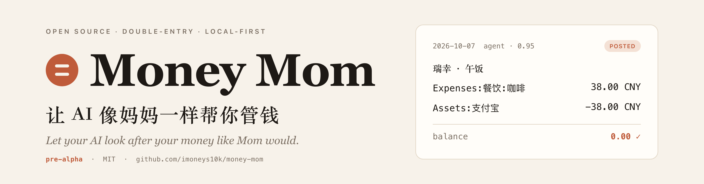
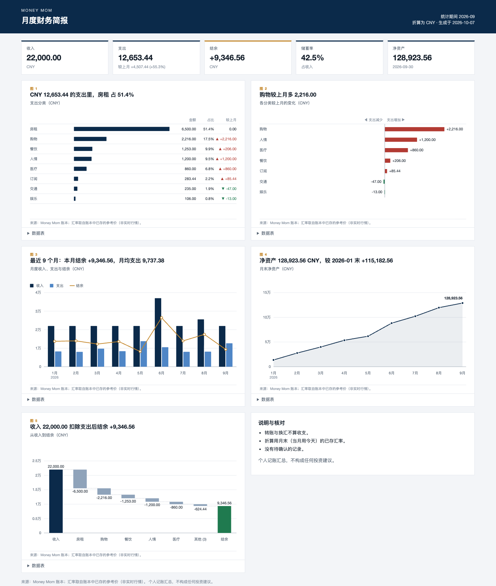
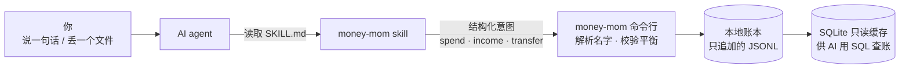

<p align="center">
  <picture>
    <source media="(prefers-color-scheme: dark)" srcset="assets/banner-dark.png">
    
  </picture>
</p>

<p align="center">
  <b>简体中文</b> &nbsp;·&nbsp; <a href="README.en.md">English</a> &nbsp;·&nbsp; <a href="https://imoneys10k.github.io/money-mom/">主页</a> &nbsp;·&nbsp; <a href="https://pypi.org/project/money-mom/">PyPI</a>
</p>

<p align="center">
  <a href="https://pypi.org/project/money-mom/"></a>
  <a href="https://github.com/imoneys10k/money-mom/actions/workflows/test.yml"></a>
  
  
  
  
</p>

# Money Mom

**让 AI 像妈妈一样帮你管钱。**

Money Mom 是装进 AI agent（Claude Code、Codex、Cursor、Gemini CLI……）的**记账能力**。你不用打开记账 App：说一句话，或丢一个账单文件，AI 帮你记账、查账、对账、管投资。账本是你自己电脑上的纯文本文件，不上传，不被任何公司锁住。

它要解决的不是“又一个记账软件”，而是让 AI 记账**值得信任**：AI 只负责听懂你的话，**账由程序来记、来校验**。

> [!NOTE]
> **状态：pre-alpha（`0.1.0a7`）。** 核心功能已经可用，都有测试，并已发布到 [PyPI](https://pypi.org/project/money-mom/)（`uv tool install "money-mom==0.1.0a7"`）；npm 启动器稍后发布。不要把唯一的账放在它上面。

<p align="center">
  <a href="#一句话安装">安装</a> &nbsp;·&nbsp; <a href="#用起来是这样">示例</a> &nbsp;·&nbsp; <a href="#为什么可信">为什么可信</a> &nbsp;·&nbsp; <a href="#功能详解">功能</a> &nbsp;·&nbsp; <a href="#状态与路线图">路线图</a> &nbsp;·&nbsp; <a href="#文档">文档</a>
</p>

## 亮点

| | | | |
|---|---|---|---|
| **说一句话就记账**<br/>“午饭 38，支付宝”。AI 听懂，程序按复式记账写入并校验平衡。 | **账单一丢就导入**<br/>微信、支付宝、银行的 CSV 与 `.xlsx`；逐笔对账，对上了才封存。 | **同一笔钱不记两次**<br/>跨来源的重复由程序找、由你判断；自己账户间的转账合成一笔。 | **投资也能管**<br/>成本批次、先进先出、已实现与浮动盈亏；读取 TradeGit 日志。 |
| **月报与图表**<br/>先给结论再给图，投研报告风格，可隐藏金额后分享。 | **订阅与异常提醒**<br/>周期扣款、涨价、重复扣款，附证据，只提醒不替你决定。 | **多币种**<br/>币种从不靠猜；汇率带来源；港美股、台币都能折算。 | **防篡改，本地优先**<br/>哈希链找出改动；数据在你电脑上，运行时零依赖。 |

<p align="center"></p>

*上图用合成的演示数据生成。*

## 一句话安装

对你的 AI agent 说：

```text
请阅读 https://github.com/imoneys10k/money-mom/blob/main/INSTALL.md 并按说明为我安装 Money Mom。
```

agent 会读 [INSTALL.md](INSTALL.md)：装好 `money-mom` 命令（锁定版本、校验 SHA-256），把 skill 装进你的 agent，再问你要中文还是英文账户树、本位币，最后跑一次不写入的自检。每一步会告诉你它要做什么。

## 用起来是这样

```text
你     午饭瑞幸 38，支付宝付的
妈妈   记好了：咖啡 38 元，从支付宝扣。

你     给小王转了 200
妈妈   这笔算借给他的、请客，还是礼金？              ← 拿不准就问，不猜

你     工资 18500 到银行卡了
妈妈   记上了。这个月储蓄率目前是 39%，比上月高。

你     这个月外卖怎么花这么多？
妈妈   比上月多了 612 元，主要是 20 号一顿聚餐 486 元。每个数字都能点回原始记录。
```

> 以上是目标形态。其中“记账、追问、查账”已经由 skill 加命令行实现；月报由 `money-mom report` 提供；“妈妈”式的点评语气档位仍在计划中。

## 为什么可信

| 原则 | 怎么做到 |
|---|---|
| **复式记账** | 每笔钱都记“从哪来、到哪去”，每个币种必须恰好平衡，否则整笔拒绝。 |
| **AI 不直接写账** | AI 只说“花了 38，从支付宝，买咖啡”；借贷方向、校验、写入都由程序完成。 |
| **只追加，不改历史** | 记错了不擦掉，而是作废并重记；每一笔的来源、置信度、谁写的都留着。 |
| **从不靠猜** | 账户名只认全名、别名或唯一匹配；含糊的整笔记为“待确认”，并列出候选。AI 的置信度低于 0.9 也先待确认。 |
| **同一笔钱不记两次** | 不同来源（微信账单、银行账单、你对 AI 说的话）里的同一笔支付，由程序找出候选并附上证据，**你来判断**是不是同一笔；拿不准的账单行先挂起，不计入任何余额。 |
| **防篡改** | 每个事件带着它之前所有事件的哈希；被改过、删掉或手工塞进去的事件，`money-mom verify` 能找出来。 |
| **对账后锁定** | 核对过银行余额的时期会被锁定，回头改只能由你本人写明原因。 |
| **本地优先** | 数据只在你的电脑上，是人能读的纯文本；程序默认不联网、没有运行时依赖。唯一会联网的是你主动运行的 `rates update`（取汇率），而且只发送币种代码和日期，不发送金额或账户。 |

## 工作原理



账本是一串只追加的事件（开户、交易、确认、作废、余额断言）；当前余额由事件推导。详见 [数据模型](docs/data-model.md) 和 [设计原则](docs/design.md)。

## 快速开始

需要 Python 3.11+。从源码安装：

```bash
git clone https://github.com/imoneys10k/money-mom && cd money-mom
python -m pip install -e .

export MONEY_MOM_HOME=~/MoneyMom        # 账本放在仓库之外
money-mom init --template cn --date 2026-01-01      # 中文账户树：现金、支付宝、微信、银行卡……

money-mom transfer 20000 --from 期初 --to 银行卡 --date 2026-01-02   # 期初余额
money-mom income 18500 --to 银行卡 --category 工资 --date 2026-10-01
money-mom spend 38 --from 支付宝 --category 咖啡 --payee 瑞幸          # 借贷方向由程序决定
money-mom spend 45 --from 微信 --category 咖                          # 名字不确定：不猜，记为待确认

money-mom pending                                  # 看有什么等你确认
money-mom confirm <ID> --category 餐饮:聚餐         # 按名字补全，再入账
money-mom balance                                  # 精确到分的余额
money-mom report --month 2026-09                   # 月报：收支、分类、和上月对比、净资产变化
money-mom chart                                    # 一页图表简报（HTML）
money-mom alerts                                   # 订阅（周期扣款）与异常提醒
money-mom dupes                                    # 可能重复的支付，等你来判断
money-mom verify                                   # 账本有没有被改过
money-mom query "SELECT month, account, amount FROM v_monthly"
money-mom doctor                                   # 自检
```

## 功能详解

<details>
<summary><b>账单导入与对账</b> · 微信、支付宝、银行；逐笔对账，对上了才封存</summary>

每家银行、每个钱包的导出文件格式都不一样，所以先用一份**映射文件**描述一次，之后每次都按同样的方式处理：

```bash
money-mom import inspect 支付宝账单.csv                 # 探测编码、表头和各列含义，给出建议（含糊处不替你决定）
money-mom import save-map alipay 映射.toml              # 校验后保存
money-mom import run 支付宝账单.csv --map alipay --account 支付宝 --dry-run   # 先试运行
money-mom import run 支付宝账单.csv --map alipay --account 支付宝
money-mom import rule-add --map alipay --match 美团 --account 外卖   # 没命中规则的行会待确认，回答一次就变成规则
money-mom import recheck --map alipay                   # 把等着的行按新规则补全

money-mom reconcile 银行卡 招行9月.csv --map cmb --closing-from-statement             # 逐笔对账
money-mom reconcile 银行卡 招行9月.csv --map cmb --closing-from-statement --assert    # 全部对上才封存（锁定该期间）
```

- **没有内置的银行预设。** 导出格式常变，而预设没有真实样本就是编造；`import inspect` 会帮你（或你的 agent）写出映射，日期是日/月先后、哪个符号代表收入这类含糊处会问你。
- **支付宝有映射草案，未经真实导出验证；微信映射只用一份真实导出核对过。** 都在 [`skills/money-mom/references/mappings/`](skills/money-mom/references/mappings/) 里，只是起点：先用 `import inspect` 对照你自己的文件，表头对不上就先改映射，再 `--dry-run` 抽查几行。表头对不上时导入会直接拒绝，不会写错账。`.xlsx` 账单（微信默认导出）可以直接导入。微信映射默认跳过银行卡付款的行（它们会出现在银行卡自己的账单里，两边都导会记两遍）；文件开头写明了它不处理什么。
- **重复导入是安全的。** 每行有稳定的哈希，已经在账本里的行会被跳过；整批全有或全无，被拒绝的行会按账单行号指出。
- **问一次，学一次。** 没有规则命中的行记为待确认，并按对方分组；回答一次写成规则，`recheck` 把等着的历史行一并补全。
- **对账找出漏记、多记、金额不符，以及可能被扣了两次的款项**，并核对期末余额；只有完全对上才允许封存。PDF 账单由 agent 读取后以 JSON 提交，程序本身不解析 PDF。

</details>

<details>
<summary><b>同一笔钱不记两次</b> · 跨来源重复与自己账户间的转账，候选由程序找、判断由你做</summary>

同一笔支付常常会从两个地方进账本：微信账单和银行账单各一次，或者你先对 AI 说了一次、账单里又来一次。同一份文件重复导入早就会被跳过；这里处理的是**不同来源**之间的重复。

```bash
money-mom dupes                                          # 列出还没判断的候选，每对都附证据
money-mom dupes resolve ID1 ID2 --same --keep ID1        # 你说“是同一笔”：另一笔被作废（不删除），并记住
money-mom dupes resolve ID1 ID2 --different              # 你说“是两笔”：记住，以后不再问，被挂起的账单行转入账本
```

- **程序只找候选，不替你决定。** 金额、币种、方向必须完全一样，日期要接近（默认相差两天内）；再看证据：账单行上的支付方式指向另一边的账户（微信账单写着“招商银行信用卡(1234)”，而你把这张卡的别名起成含 1234）、对方或说明相同、同一天同一账户里一笔手记一笔账单。证据强的列为 `likely`，只有金额相同的列为 `possible`。
- **拿不准的账单行先挂起。** 导入时发现一行像是账本里已有的一笔，它会被记成“待确认”（不计入任何余额），等你回答后才进账：回答“是同一笔”就作废，回答“不是”就转入账本。作废的行再次导入同一份账单也不会回来。
- **AI 必须转述你的回答**（`--user-said`），否则命令拒绝执行；每次判断都作为一条事件留在账本里，可以追溯，也可以撤销。
- **你自己账户之间的转账**（银行扣了 500、微信到账 500，两份账单各出现一次）也会被找出来：两边金额相反、账户不同，一边点名了另一边的账户或带“转账/充值/提现/还款”字样，就列为候选。你说“是同一笔转账”，两行都被作废，换成一笔真正的转账（`dupes resolve ID1 ID2 --transfer`）；没有任何理由时，只有一边还没分类才会问，已经被你的规则分好类的不打扰你。
- **不覆盖：** 同一份文件内的重复行（本来就由行哈希处理）。

</details>

<details>
<summary><b>投资者包：持仓、成本与盈亏</b> · 成本批次、持仓、已实现与浮动盈亏、读取 TradeGit 日志</summary>

港股、美股的买卖按**成本批次**记：买入建立一个批次（份额、买入价、日期），卖出按先进先出（也可选后进先出、最高成本先出）从批次里拿，成本和已实现盈亏直接写进那一笔账里，不事后估算。

```bash
money-mom invest                                              # 每个账本一次：开设盈亏、股息、手续费、税的账户
money-mom buy 10 AAPL --price 150 --ccy USD --account IBKR --fee 1
money-mom sell 4 AAPL --price 170 --ccy USD --account IBKR    # 记下用了哪几批、成本、已实现盈亏
money-mom dividend 25 AAPL --to IBKR --ccy USD --tax 2.5
money-mom holdings --lots                                     # 份额、平均成本、价格及其来源、市值、浮动盈亏
money-mom pnl --year 2026                                     # 每笔卖出用了哪些批次，加股息与手续费
money-mom networth --by-account                               # 现金、银行、券商、负债，逐个账户折算，各占资产多少
money-mom trades import ~/.tradegit/repo/journal --account IBKR --dry-run   # 读取 TradeGit 日志（只读）
```

- **价格从不编造。** `holdings` 依次用你给的 `--mark`、你记下的价格（`rates set AAPL USD 190 --source ...`）、最后一笔成交价（并标明“不是行情”）；没有价格的持仓单独列出，总数标为不完整，**不会当作零**。程序不联网取股价。
- **券商流水只读导入，但不自己解析券商文件。** IBKR、嘉信的导出格式会变，没有真实样本的解析器就是猜；这些由 [TradeGit](https://github.com/rollingSirius/TradeGit) 读取，Money Mom 读取它规范化后的日志（含更正与作废）。其他券商，让 AI 读账单后以 JSON 行提交。期权、卖空、零价事件（如到期）、调整等**不会被猜**，逐条列出；卖出超过账本里的持仓会让整批停下并指出哪一行（通常缺一个期初持仓：`buy ... --opening`）。重复导入是安全的。
- **台币等欧洲央行没有的币种**：`rates update` 会向第二个来源（open.er-api.com）只询问这些币种的最新汇率，输出里逐条标明来源；`--no-fallback` 可关闭。
- **不覆盖：** 卖空、期权与期货、拆股与分拆（会改变此前所有批次的成本）、平均成本法、税务建议。

</details>

<details>
<summary><b>月报与图表</b> · 先给结论，再给图；投研报告风格；可隐藏金额分享</summary>

```bash
money-mom report --month 2026-09                    # 月报：收支、分类、和上月对比、净资产变化
money-mom chart --month 2026-09                     # 一页图表简报（HTML），写进账本目录的 charts/
money-mom chart spending --format svg --lang en     # 单张图，SVG
money-mom chart --hide-amounts                      # 只画比例与形状，没有任何金额，可以放心分享
```

- **先给结论，再给图：** 页面从最重要的一个数字（本月结余，以及收入花在哪里）开始，接着是带迷你走势的指标卡和几条直接读出来的要点（结余与储蓄率、最大的分类、较上月的变化，以及哪些数字要打折扣：待确认、缺汇率、本月未结束），然后才是五张图。手机上打开会换成专门为窄屏重画的版本，文字不会缩成看不清。
- **风格取自投研报告：** 深海军蓝配钢蓝灰，只用一个琥珀色强调，涨跌用沉稳的红绿；只画水平细网格，等宽数字；标题直接写结论，每张图下有来源，并附可展开的数据表。支出增加用红色加 ▲，减少用绿色加 ▼，不只靠颜色区分。自动跟随系统深色模式，也能直接打印。
- **图只画月报已经算好的数字。** 折算规则与月报完全一致；缺汇率的币种明确标注，没有数据的月份是空缺，不画成 0。
- **只是几个静态文件：** 不含脚本、不加载字体或任何外部资源、不联网，离线也能打开。`--format json` 给 agent 图背后的数字，让它自己画。

</details>

<details>
<summary><b>订阅与异常提醒</b> · 周期扣款、涨价、该扣没扣、异常大额，附证据</summary>

```bash
money-mom alerts                    # 本月至今：周期扣款（订阅）和值得看一眼的事
money-mom alerts --month 2026-09
```

- **识别周期扣款：** 同一个对方、同一个币种，按固定间隔扣款——每周（至少 4 次）、每月（至少 3 次）或每年（至少 2 次）。列出每笔订阅的金额是否固定、上次和下次预计扣款日、折合每月多少钱。
- **提醒只有五种，每条都带证据和规则：** 涨价或降价（一直固定的金额变了）、该扣没扣（可能已取消，也可能走了别的渠道，程序分不出来）、单笔异常大、某分类突然飙升、疑似重复扣款（同一对方同一金额两天内两次）。每条提醒都附交易 ID，可以用 `show` 逐笔核对，判定规则也一并返回。
- **证据不够就不说话。** 不满三个月的记录、没有填对方的记录都不会被硬判成订阅或异常，并明确提示原因。对方名称只做大小写和空格归一后的精确匹配，不做模糊猜测。
- **只提醒，不替你做决定**，也不联网、不发通知；是否取消订阅、是不是重复扣款，由你来定。

</details>

<details>
<summary><b>多币种</b> · 币种从不靠猜，汇率带来源，折算可复核</summary>

不必固定一个币种：

```bash
money-mom open Assets:美元户 --currency USD                 # 开一个只收美元的账户
money-mom spend '5美元' --from 现金 --category 咖啡          # 金额里写币种：5美元、HK$200、USD 5
money-mom spend 5 --from 美元户 --category 咖啡              # 或由账户决定：只收美元的账户就是美元
money-mom exchange 100 USD 720 CNY --from 美元户 --to 银行卡  # 换汇：实际成交汇率记在账里

money-mom rates update      # 唯一会联网的命令：取欧洲央行每日参考汇率
money-mom networth          # 所有币种折成本位币的净资产
money-mom balance --account Assets --in CNY  # 资产账户逐个折算并合计
```

- **币种从不靠猜。** `$`、`¥` 这类有歧义的符号，先看账户允许的币种，再看账本里在用的币种；非本位币的推断会先记为待确认，仍不确定就问你并列出候选。写 `$` 时记得用单引号（shell 会把 `$5` 当变量），或者改用 `--ccy USD`。
- **汇率是每日参考价，不是实时行情。** 来源是欧洲央行（经 Frankfurter），每个工作日一次，约 30 种货币，**不含台币**；不支持的币种可以用 `money-mom rates set` 手动记，必须写来源。
- **折算可复核。** 每个汇率连同来源一起存进账本，折算只用已存的汇率、只用不晚于所查日期的汇率；缺汇率的币种会明确列出而不是悄悄丢掉，超过 7 天的汇率标为过期。

每个命令都支持 `--json`，退出码 0 成功、1 账本拒绝、2 用法错误。完整命令见 `money-mom --help` 或 [命令参考](skills/money-mom/references/commands.md)。

</details>

<details>
<summary><b>防篡改</b> · 每个事件带哈希；发现改动，而不是阻止</summary>

账本是只追加的文本文件，但文件本身谁都能改。所以每个事件都带一个哈希，由它之前的所有事件推出来；`money-mom verify`（也包含在 `check` 和 `doctor` 里）会找出被改过、被删掉、被手工塞入的事件。这是**发现**篡改，不是阻止：如果有人重算了之后所有的哈希，它发现不了——所以 `verify` 会打印链头，你可以把它记在别处，以后对照，就能发现末尾被截掉的部分。全部在本地完成，不联网。升级前写下的旧事件，从下一次写入起被覆盖。

</details>


## 兼容的 AI agent

Money Mom 的 skill 采用开放的 [Agent Skills](https://agentskills.io) 标准（`SKILL.md`），已通过官方校验器。同一份 skill 可用于 Claude Code、Codex、Cursor、Gemini CLI、GitHub Copilot 等支持该标准的 agent。

诚实地说：安装器（`npx skills add`）已在隔离环境里验证过会把 skill 放到 Claude Code、Codex、Gemini CLI 读取的目录；**还没有在每个 agent 里逐一实测对话效果**，这一项在[路线图](ROADMAP.md)里。

## 状态与路线图

| | |
|---|---|
| 已完成 | 账本内核 · 命令行 · SQLite 查账 · 月报与图表 · 订阅与异常提醒 · 意图层（spend / income / transfer）· 账单导入与对账（映射、规则、去重、逐笔比对、封存）· `.xlsx` 账单直接导入 · 投资者包（成本批次、持仓、已实现与浮动盈亏、读取 TradeGit 日志、逐账户净资产）· 跨来源防重复（候选、挂起、由你判断）· 哈希链防篡改（`verify`）· 发布到 PyPI· 多币种（币种识别、汇率折算、换汇）· 中英文账户树模板 · skill 与安装说明 · `doctor` · 三系统 CI（Linux、macOS、Windows） |
| 下一步 | “妈妈”语气档位 · 用真实导出文件验证支付宝映射，再多验证几份微信导出 |
| 之后 | 发布 npm 启动器 · Claude Code 插件市场 · Beancount 导出 |

不做什么：不碰转账、下单等任何资金操作；不保存银行凭证；银行与券商数据只读导入。

## 文档

| 文档 | 内容 |
|---|---|
| [INSTALL.md](INSTALL.md) | 给 agent 读的安装说明（锁定版本，校验 SHA-256） |
| [skills/money-mom/SKILL.md](skills/money-mom/SKILL.md) | 给 agent 读的使用说明 |
| [命令参考](skills/money-mom/references/commands.md) · [SQL 参考](skills/money-mom/references/sql.md) | 每个命令与参数；可直接查账的表和视图 |
| [docs/design.md](docs/design.md) · [docs/data-model.md](docs/data-model.md) | 设计原则与已做的决定；数据模型（事件、批次、哈希链） |
| [docs/agents.md](docs/agents.md) | 各 agent 的 skill 加载方式调研 |
| [ROADMAP.md](ROADMAP.md) · [CHANGELOG.md](CHANGELOG.md) | 路线图与版本记录 |

## 开发

```bash
python -m pip install -e .
python -m unittest discover -s tests -v
```

需要 Python 3.11+，运行时没有第三方依赖。参与开发的 AI agent 请先读 [AGENTS.md](AGENTS.md)。仓库是公开的：**不要提交任何真实财务数据。**

## 许可证

[MIT](LICENSE)
