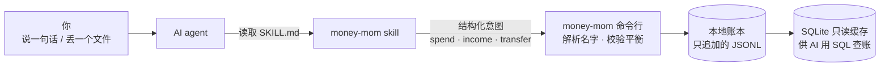

<p align="center">
  <picture>
    <source media="(prefers-color-scheme: dark)" srcset="assets/banner-dark.png">
    
  </picture>
</p>

<p align="center">
  <b>简体中文</b> &nbsp;·&nbsp; <a href="README.en.md">English</a> &nbsp;·&nbsp; <a href="https://imoneys10k.github.io/money-mom/">主页</a>
</p>

<p align="center">
  <a href="https://github.com/imoneys10k/money-mom/actions/workflows/test.yml"></a>
  
  
  
</p>

# Money Mom

**让 AI 像妈妈一样帮你管钱。**

Money Mom 是一个装进 AI agent（Claude Code、Codex、Cursor、Gemini CLI……）的**记账能力**。你不用打开记账 App：说一句话，或丢一个账单文件，AI 帮你记账、查账、对账。账本是你自己电脑上的纯文本文件，不上传，不被任何公司锁住。

它做的不是“又一个记账软件”，而是让 AI 记账这件事**值得信任**：AI 只负责听懂你的话，**账由程序来记、来校验**。

> **状态：pre-alpha（`0.1.0a2`）。** 账本内核、命令行和 skill 已经可以用，也都经过测试；但还没有发布到 PyPI 或 npm，对账、账单导入、投资者功能还在路上（见[路线图](ROADMAP.md)）。不要把唯一的账放在它上面。

## 一句话安装

对你的 AI agent 说：

```text
请阅读 https://github.com/imoneys10k/money-mom/blob/main/INSTALL.md 并按说明为我安装 Money Mom。
```

agent 会读 [INSTALL.md](INSTALL.md)：装好 `money-mom` 命令（锁定版本、校验 SHA-256），把 skill 装进你的 agent，再问你要中文还是英文账户树、本位币，最后跑一次不写入的自检。每一步会告诉你它要做什么。

## 用起来是这样

```text
你     午饭瑞幸 38，支付宝付的
妈妈   记好了：咖啡 38 元，从支付宝扣。

你     给小王转了 200
妈妈   这笔算借给他的、请客，还是礼金？              ← 拿不准就问，不猜

你     工资 18500 到银行卡了
妈妈   记上了。这个月储蓄率目前是 39%，比上月高。

你     这个月外卖怎么花这么多？
妈妈   比上月多了 612 元，主要是 20 号一顿聚餐 486 元。每个数字都能点回原始记录。
```

> 以上是目标形态。其中“记账、追问、查账”已经由 skill 加命令行实现；“储蓄率点评”依赖月报，尚在计划中。

## 为什么可信

| 原则 | 怎么做到 |
|---|---|
| **复式记账** | 每笔钱都记“从哪来、到哪去”，每个币种必须恰好平衡，否则整笔拒绝。 |
| **AI 不直接写账** | AI 只说“花了 38，从支付宝，买咖啡”；借贷方向、校验、写入都由程序完成。 |
| **只追加，不改历史** | 记错了不擦掉，而是作废并重记；每一笔的来源、置信度、谁写的都留着。 |
| **从不靠猜** | 账户名只认全名、别名或唯一匹配；含糊的整笔记为“待确认”，并列出候选。AI 的置信度低于 0.9 也先待确认。 |
| **对账后锁定** | 核对过银行余额的时期会被锁定，回头改只能由你本人写明原因。 |
| **本地优先** | 数据只在你的电脑上，是人能读的纯文本；程序默认不联网、没有运行时依赖。唯一会联网的是你主动运行的 `rates update`（取汇率），而且只发送币种代码和日期，不发送金额或账户。 |

## 工作原理



账本是一串只追加的事件（开户、交易、确认、作废、余额断言）；当前余额由事件推导。详见 [数据模型](docs/data-model.md) 和 [设计原则](docs/design.md)。

## 命令行试用

需要 Python 3.11+。从源码安装：

```bash
git clone https://github.com/imoneys10k/money-mom && cd money-mom
python -m pip install -e .

export MONEY_MOM_HOME=~/MoneyMom        # 账本放在仓库之外
money-mom init --template cn --date 2026-01-01      # 中文账户树：现金、支付宝、微信、银行卡……

money-mom transfer 20000 --from 期初 --to 银行卡 --date 2026-01-02   # 期初余额
money-mom income 18500 --to 银行卡 --category 工资 --date 2026-10-01
money-mom spend 38 --from 支付宝 --category 咖啡 --payee 瑞幸          # 借贷方向由程序决定
money-mom spend 45 --from 微信 --category 咖                          # 名字不确定：不猜，记为待确认

money-mom pending                                  # 看有什么等你确认
money-mom confirm <ID> --category 餐饮:聚餐         # 按名字补全，再入账
money-mom balance                                  # 精确到分的余额
money-mom query "SELECT month, account, amount FROM v_monthly"
money-mom doctor                                   # 自检
```

## 多币种

不必固定一个币种：

```bash
money-mom open Assets:美元户 --currency USD                 # 开一个只收美元的账户
money-mom spend '5美元' --from 现金 --category 咖啡          # 金额里写币种：5美元、HK$200、USD 5
money-mom spend 5 --from 美元户 --category 咖啡              # 或由账户决定：只收美元的账户就是美元
money-mom exchange 100 USD 720 CNY --from 美元户 --to 银行卡  # 换汇：实际成交汇率记在账里

money-mom rates update      # 唯一会联网的命令：取欧洲央行每日参考汇率
money-mom networth          # 所有币种折成本位币的净资产
money-mom balance --account Assets --in CNY  # 资产账户逐个折算并合计
```

- **币种从不靠猜。** `$`、`¥` 这类有歧义的符号，先看账户允许的币种，再看账本里在用的币种；非本位币的推断会先记为待确认，仍不确定就问你并列出候选。写 `$` 时记得用单引号（shell 会把 `$5` 当变量），或者改用 `--ccy USD`。
- **汇率是每日参考价，不是实时行情。** 来源是欧洲央行（经 Frankfurter），每个工作日一次，约 30 种货币，**不含台币**；不支持的币种可以用 `money-mom rates set` 手动记，必须写来源。
- **折算可复核。** 每个汇率连同来源一起存进账本，折算只用已存的汇率、只用不晚于所查日期的汇率；缺汇率的币种会明确列出而不是悄悄丢掉，超过 7 天的汇率标为过期。

每个命令都支持 `--json`，退出码 0 成功、1 账本拒绝、2 用法错误。完整命令见 `money-mom --help` 或 [命令参考](skills/money-mom/references/commands.md)。

## 兼容的 AI agent

Money Mom 的 skill 采用开放的 [Agent Skills](https://agentskills.io) 标准（`SKILL.md`），已通过官方校验器。同一份 skill 可用于 Claude Code、Codex、Cursor、Gemini CLI、GitHub Copilot 等支持该标准的 agent。

诚实地说：安装器（`npx skills add`）已在隔离环境里验证过会把 skill 放到 Claude Code、Codex、Gemini CLI 读取的目录；**还没有在每个 agent 里逐一实测对话效果**，这一项在[路线图](ROADMAP.md)里。

## 当前状态

| | |
|---|---|
| 已完成 | 账本内核 · 命令行 · SQLite 查账 · 意图层（spend / income / transfer）· 多币种（币种识别、汇率折算、换汇）· 中英文账户树模板 · skill 与安装说明 · `doctor` · 三系统 CI（Linux、macOS、Windows） |
| 下一步 | 月报 · 银行对账与账单导入（支付宝、微信、银行 PDF）· 订阅与异常提醒 · “妈妈”语气档位 |
| 之后 | 发布到 PyPI / npm · Claude Code 插件市场 · Beancount 导出 · 投资者包（港美股持仓与成本、已实现与未实现盈亏） |

不做什么：不碰转账、下单等任何资金操作；不保存银行凭证；银行与券商数据只读导入。

## 文档

- [INSTALL.md](INSTALL.md)：给 agent 读的安装说明
- [skills/money-mom/SKILL.md](skills/money-mom/SKILL.md)：给 agent 读的使用说明
- [ROADMAP.md](ROADMAP.md) · [CHANGELOG.md](CHANGELOG.md)
- [docs/design.md](docs/design.md)：设计原则与已做的决定 · [docs/data-model.md](docs/data-model.md)：数据模型 · [docs/agents.md](docs/agents.md)：各 agent 的加载方式调研

## 开发

```bash
python -m pip install -e .
python -m unittest discover -s tests -v
```

需要 Python 3.11+，运行时没有第三方依赖。参与开发的 AI agent 请先读 [AGENTS.md](AGENTS.md)。仓库是公开的：**不要提交任何真实财务数据。**

## 许可证

[MIT](LICENSE)
